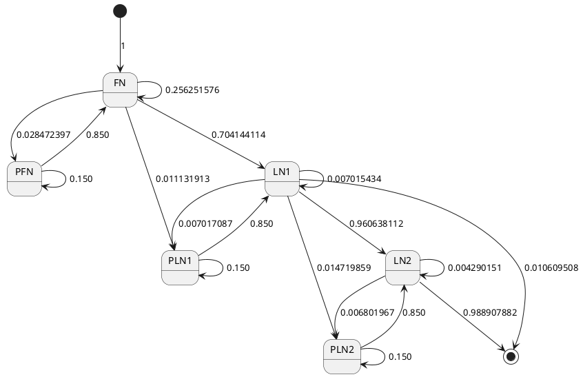
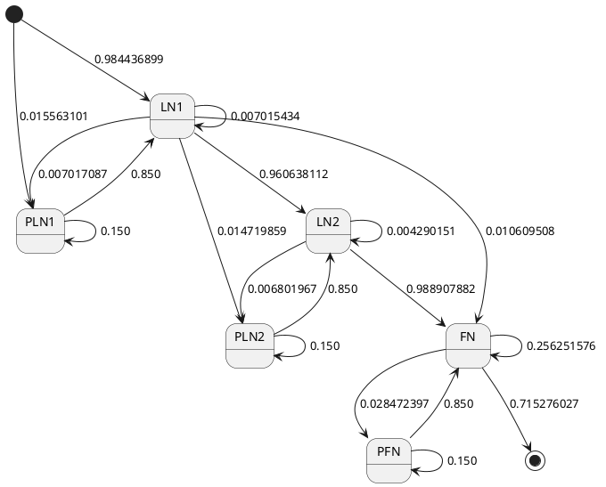

# Graph of states and transitions

TODO: recalculate probabilities using new data files.

## States

+ START: initial state
+ FN: first name
+ PFN: particle of first name
+ LN1: last name 1
+ PLN1: particle of last name 1
+ LN2: last name 2
+ PLN2: particle of last name 2
+ END final state

## Tokens

+ PFN, PLN1, PLN2: (DA|DAS|DE|DEL|DEN|DER|DES|DI|DO|DOS|DU|I|LA|LAS|LE|LO|LOS|MAC|MC|SAN|ST|VAN|VON|Y)
+ FN, LN1, LN2: last 4 characters of each word

## Probabilities

```sql
select sum(frec) from nombres
-- 43975556

-- P(START --> FN) = 1

-- P(FN --> LN1 or PLN1) = 31454661 / 43975556 = 0.715276027
select sum(frec)
from nombres
where nombre not like '% %'
-- 31454661

-- P(FN --> FN or PFN) = 1 - 0.715276027 = 0.284723973

-- P(FN --> FN) = 0.284723973 * 0.9 = 0.256251576
-- P(FN --> PFN) = 0.284723973 * 0.1 = 0.028472397

select sum(frec_pri + frec_rep)
from apellidos
-- 45988456

-- P(PLN1 before LN1) = 715723 / 45988456 = 0.015563101
-- P(LN1 before PLN1) = 1 - 0.015563101 = 0.984436899
select sum(frec_pri + frec_rep)
from apellidos
where apellido regexp '^(DA|DAS|DE|DEL|DEN|DER|DES|DI|DO|DOS|DU|I|LA|LAS|LE|LO|LOS|MAC|MC|SAN|ST|VAN|VON|Y) '
-- 715723

-- P(FN --> LN1) = 0.715276027 *  0.984436899 = 0.704144114
-- p(FN --> PLN1) = 0.715276027 * 0.015563101 = 0.011131913

-- P(LN1 --> PLN1) = 322705 / 45988456 = 0.007017087
select sum(frec_pri + frec_rep)
from apellidos
where apellido regexp ' (DA|DAS|DE|DEL|DEN|DER|DES|DI|DO|DOS|DU|I|LA|LAS|LE|LO|LOS|MAC|MC|SAN|ST|VAN|VON|Y) '
-- 322705

-- P(LN1 --> LN1) = 322629 / 45988456 = 0.007015434
select sum(frec_pri + frec_rep)
from apellidos
where apellido like '% %' and
apellido not regexp ' (DA|DAS|DE|DEL|DEN|DER|DES|DI|DO|DOS|DU|I|LA|LAS|LE|LO|LOS|MAC|MC|SAN|ST|VAN|VON|Y) ' and
apellido not regexp '^(DA|DAS|DE|DEL|DEN|DER|DES|DI|DO|DOS|DU|I|LA|LAS|LE|LO|LOS|MAC|MC|SAN|ST|VAN|VON|Y) ' and
apellido not regexp ' (DA|DAS|DE|DEL|DEN|DER|DES|DI|DO|DOS|DU|I|LA|LAS|LE|LO|LOS|MAC|MC|SAN|ST|VAN|VON|Y)$'
-- 322629

-- P(LN1 --> PLN2 or LN2 or END) = 1 - 0.007017087 - 0.007015434 = 0.985967479

-- P(LN2 is null) = 494859 / 45988456 = 0.010760505
select sum(frec_pri)
from apellidos
where frec_seg = 0
-- 494859

-- P(PLN2 before LN2) = 686578 / 45988456 = 0.014929355
-- P(LN2 before PLN2) = 1 - 0.014929355 - 0.010760505 = 0.97431014
select sum(frec_seg + frec_rep)
from apellidos
where apellido regexp '^(DA|DAS|DE|DEL|DEN|DER|DES|DI|DO|DOS|DU|I|LA|LAS|LE|LO|LOS|MAC|MC|SAN|ST|VAN|VON|Y) '
-- 686578

-- P(LN1 --> PLN2) = 0.985967479 * 0.014929355 = 0.014719859
-- P(LN1 --> LN2) = 0.985967479 * 0.97431014 = 0.960638112
-- P(LN1 --> END) = 0.985967479 * 0.010760505 = 0.010609508

select sum(frec_seg + frec_rep)
from apellidos
where frec_seg > 0
-- 43372599

-- P(LN2 --> LN2) = 186075 / 43372599 = 0.004290151
select sum(frec_seg + frec_rep)
from apellidos
where apellido like '% %' and
apellido not regexp ' (DA|DAS|DE|DEL|DEN|DER|DES|DI|DO|DOS|DU|I|LA|LAS|LE|LO|LOS|MAC|MC|SAN|ST|VAN|VON|Y) ' and
apellido not regexp '^(DA|DAS|DE|DEL|DEN|DER|DES|DI|DO|DOS|DU|I|LA|LAS|LE|LO|LOS|MAC|MC|SAN|ST|VAN|VON|Y) ' and
apellido not regexp ' (DA|DAS|DE|DEL|DEN|DER|DES|DI|DO|DOS|DU|I|LA|LAS|LE|LO|LOS|MAC|MC|SAN|ST|VAN|VON|Y)$'
-- 186075

-- P(LN2 --> PLN2) = 295019 / 43372599 = 0.006801967
select sum(frec_seg + frec_rep)
from apellidos
where apellido regexp ' (DA|DAS|DE|DEL|DEN|DER|DES|DI|DO|DOS|DU|I|LA|LAS|LE|LO|LOS|MAC|MC|SAN|ST|VAN|VON|Y) '
-- 295019

-- P(LN2 --> END) = 1 - 0.004290151 - 0.006801967 = 0.988907882
```

## Models

### Model 1: First Name first



### Model 2: Last Name 1 first

