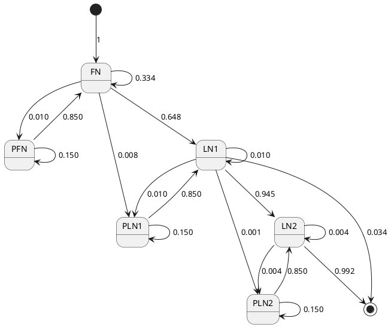
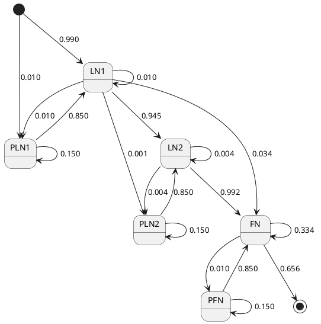

# Graph of states and transitions

TODO: recalculate probabilities using new data files.

## States

+ START: initial state
+ FN: first name
+ PFN: particle of first name
+ LN1: last name 1
+ PLN1: particle of last name 1
+ LN2: last name 2
+ PLN2: particle of last name 2
+ END final state

## Tokens

+ PFN, PLN1, PLN2: (DA|DE|DE LA|DE LAS|DE LOS|DEL|DI|DL|DO|DOS|EL|EP|I|LA|LAS|LOS|LE|SAN|VAN)
+ FN, LN1, LN2: last 4 characters of each word

## Probabilities

```sql
select count(name)
from first_name;
-- 583409

-- P(START --> FN) = 1

-- P(FN --> PFN) = 6027 / 583409 = 0,0103306599658215762869616341194599329116
select count(name)
from seguridad.pmh_dn
where regexp_like(nomb, ' (DA|DE|DE LA|DE LAS|DE LOS|DEL|DI|DL|DO|DOS|EL|EP|I|LA|LAS|LOS|LE|SAN|VAN) ')
and anno = 2018 and semestre = 2
-- 6027

-- P(FN --> FN) = 194884 / 583409 = 0,3340435269253645384284438532830312867988
select count(name)
from first_name
where name like '% %'
and not regexp_like(name, ' (DA|DE|DE LA|DE LAS|DE LOS|DEL|DI|DL|DO|DOS|EL|EP|I|LA|LAS|LOS|LE|SAN|VAN) ');
-- 194884

-- P(FN --> LN1 or PLN1) = 1 - 0,3340435269253645384284438532830312867988 - 0,0103306599658215762869616341194599329116 = 0,6556258131088138852845945125975087802896

-- P(PLN1 before LN1) = 6183 / 583409 = 0,0105980538524431402326669626282762178849
-- P(LN1 before PLN1) = 1 - 0,0105980538524431402326669626282762178849 = 0,9894019461475568597673330373717237821151
select count(name)
from last_name_1
where regexp_like(name, '^(DA|DE|DE LA|DE LAS|DE LOS|DEL|DI|DL|DO|DOS|EL|EP|I|LA|LAS|LOS|LE|SAN|VAN) ');
-- 6183

-- P(FN --> LN1) = 0,6556258131088138852845945125975087802896 * 0,9894019461475568597673330373717237821151 = 0,6486774554344348540171395232651700663024
-- p(FN --> PLN1) = 0,6556258131088138852845945125975087802896 * 0,0105980538524431402326669626282762178849 = 0,006948357674379031267454989332338713987165

-- P(LN1 --> PLN1) = 2916 / 583409 = 0,004998208803772310677414986741719788347454
select count(name)
from last_name_1
where regexp_like(name, ' (DA|DE|DE LA|DE LAS|DE LOS|DEL|DI|DL|DO|DOS|EL|EP|I|LA|LAS|LOS|LE|SAN|VAN) ');
-- 2916

-- P(LN1 --> LN1) = 3152 / 583409 = 0,005402727760456215108097406793518783563503
select count(name)
from last_name_1
where ape1 like '% %'
and not regexp_like(name, ' (DA|DE|DE LA|DE LAS|DE LOS|DEL|DI|DL|DO|DOS|EL|EP|I|LA|LAS|LOS|LE|SAN|VAN) ')
and not regexp_like(name, '^(DA|DE|DE LA|DE LAS|DE LOS|DEL|DI|DL|DO|DOS|EL|EP|I|LA|LAS|LOS|LE|SAN|VAN) ')
and not regexp_like(name, ' (DA|DE|DE LA|DE LAS|DE LOS|DEL|DI|DL|DO|DOS|EL|EP|I|LA|LAS|LOS|LE|SAN|VAN)$');
-- 3152

-- P(LN1 --> PLN2 or LN2 or END) = 1 - 0,004998208803772310677414986741719788347454 - 0,005402727760456215108097406793518783563503 = 0,989599063435771474214487606464761428089

-- P(LN2 is null) = 20492 / 583409 = 0,0351245866964685152268819987350212286749
select count(name)
from last_name_2
where name is null;
-- 20492

-- P(PLN2 before LN2) = 5878 / 583409 = 0,0100752645228304671336918011206546350845
-- P(LN2 before PLN2) = 1 - 0,0351245866964685152268819987350212286749 - 0,0100752645228304671336918011206546350845 = 0,9548001487807010176394262001443241362406
select count(name)
from last_name_2
where regexp_like(name, '^(DA|DE|DE LA|DE LAS|DE LOS|DEL|DI|DL|DO|DOS|EL|EP|I|LA|LAS|LOS|LE|SAN|VAN) ');
-- 5878

-- P(LN1 --> PLN2) = 0,989599063435771474214487606464761428089 * 0,0100752645228304671336918011206546350845 = 0,009970472335660685257568460806740841629663
-- P(LN1 --> LN2) = 0,989599063435771474214487606464761428089 * 0,9548001487807010176394262001443241362406 = 0,9448693330017169879535008232946770467052
-- P(LN1 --> END) = 0,989599063435771474214487606464761428089 * 0,0351245866964685152268819987350212286749 = 0,0347592580983938010034183223633435397541

select count(name)
from last_name_2
where name is not null;
-- 562917

-- P(LN2 --> LN2) = 2445 / 562917 = 0,004343446724827994180314326978932951038963
select count(name)
from last_name_2
where name like '% %'
and not regexp_like(name, ' (DA|DE|DE LA|DE LAS|DE LOS|DEL|DI|DL|DO|DOS|EL|EP|I|LA|LAS|LOS|LE|SAN|VAN) ')
and not regexp_like(name, '^(DA|DE|DE LA|DE LAS|DE LOS|DEL|DI|DL|DO|DOS|EL|EP|I|LA|LAS|LOS|LE|SAN|VAN) ')
and not regexp_like(name, ' (DA|DE|DE LA|DE LAS|DE LOS|DEL|DI|DL|DO|DOS|EL|EP|I|LA|LAS|LOS|LE|SAN|VAN)$');
-- 2445

-- P(LN2 --> PLN2) = 2492 / 562917 = 0,004426940383751068097072925493456406539508
select count(name)
from last_name_2
where regexp_like(name, ' (DA|DE|DE LA|DE LAS|DE LOS|DEL|DI|DL|DO|DOS|EL|EP|I|LA|LAS|LOS|LE|SAN|VAN) ');
-- 2492

-- P(LN2 --> END) = 1 - 0,004343446724827994180314326978932951038963 - 0,004426940383751068097072925493456406539508 = 0,9912296128914209377226127475276106424215
```

## Models

### Model 1: First Name first



### Model 2: Last Name 1 first

